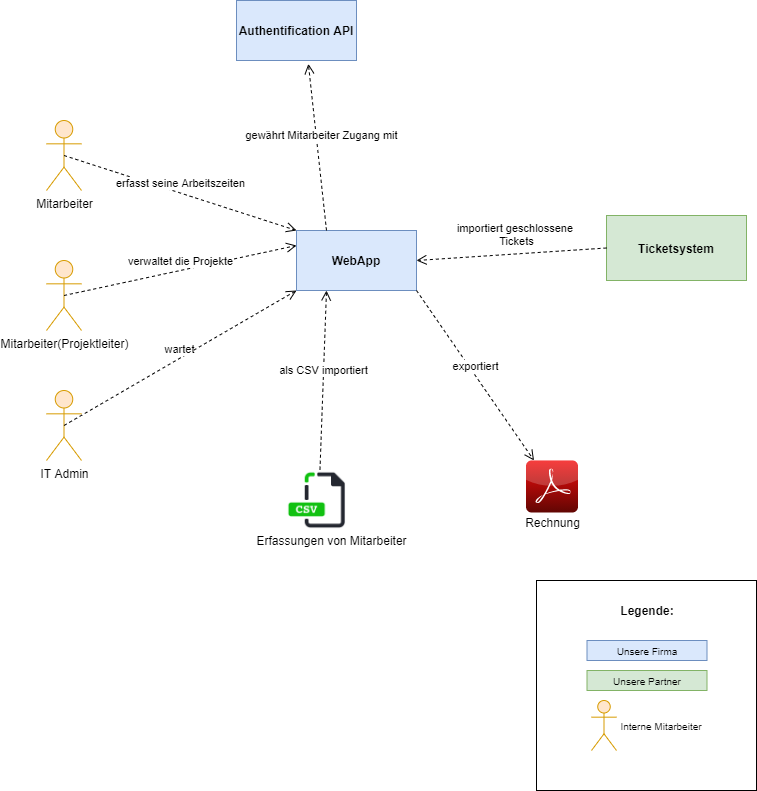
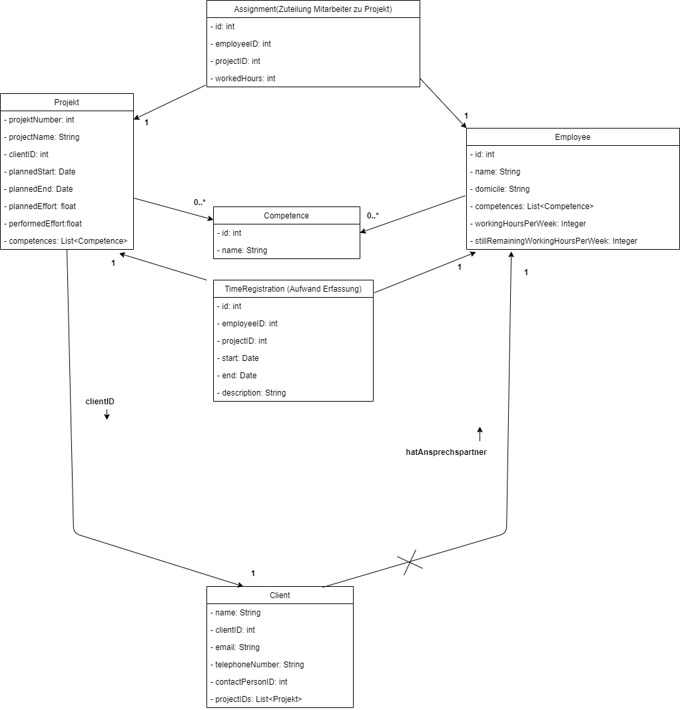
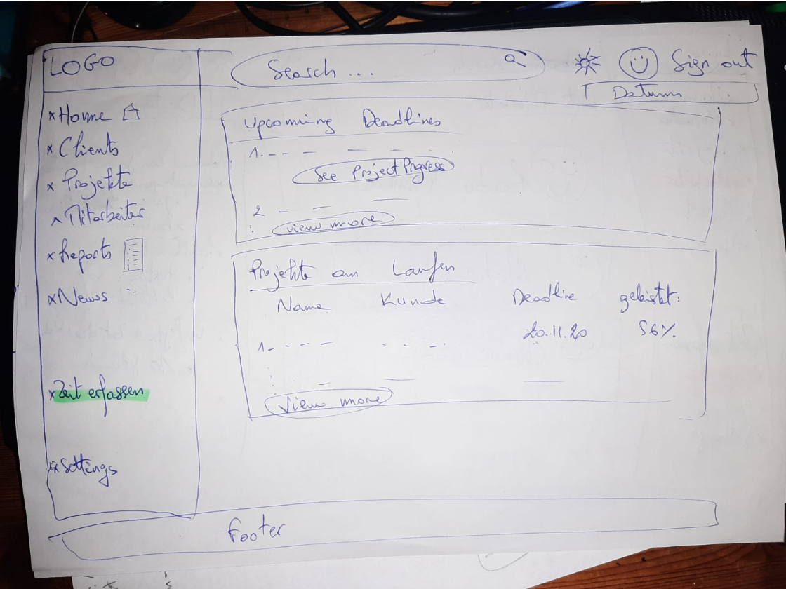
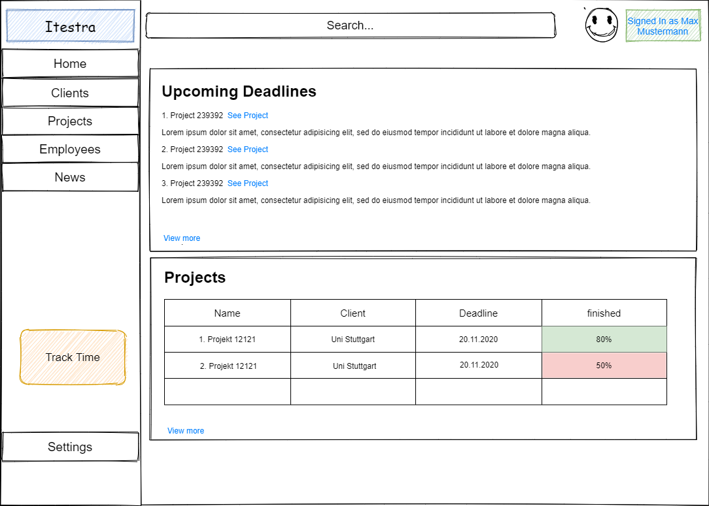
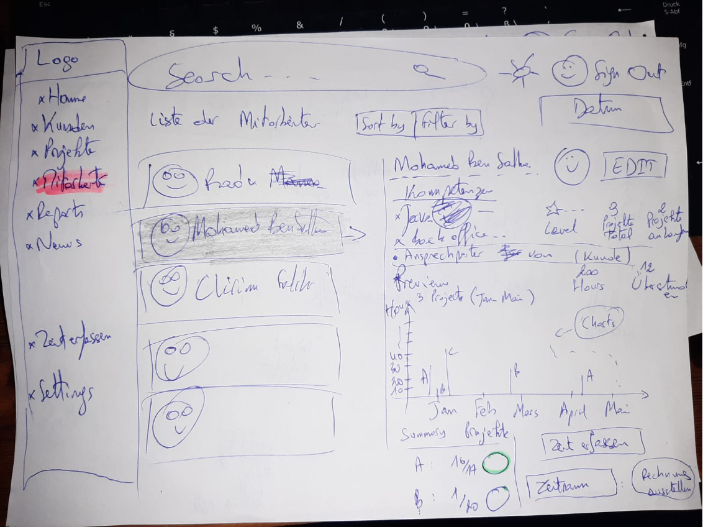
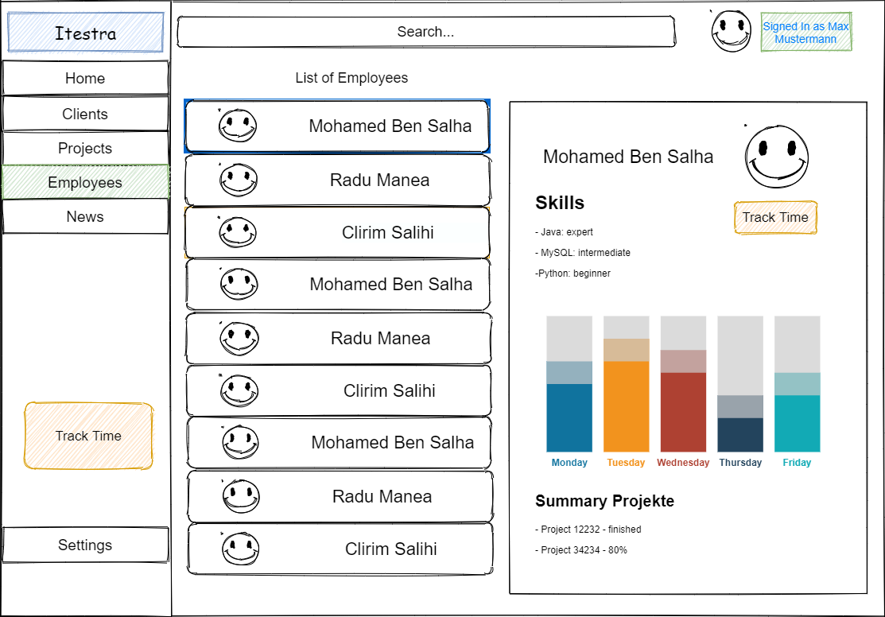

# Entwurf

> Dieser Entwurf legt die prinzipielle Lösungsarchitektur fest und enthält alles, was man benötigt, um einem Außenstehenden den prinzipiellen Aufbau der App erklären zu können.
> Der Fokus liegt auf einem groben Überblick und vereinzelten wichtigen Details (**keep it simple**).

**TODO:** Beschreibung des grundlegenden Aufbaus

**TODO:** Verweis auf Standards wie zum Beispiel verwendete Entwurfsmuster (optional)

## Inhaltsverzeichnis
1. System Context Diagram
2. UML Domain Model
3. Beschreibung der Top Packages der API
4. Beschreibung der Frontend-Views
5. GUI-Skizzen (handschriftlich und digital)

## System Context Diagram

## Domain Model

## Beschreibung der Java-Packages der API

1. **Entities:** in diesem Package werden alle Entitäten gespeichert, wie zum Beispiel Mitarbeiter, Kunde oder Projekt.
2. **Authentication:** in diesem Package werden der ganze Code sein, der sich um die sichere Authentifizierung des Mitarbeiters kümmert
3. **Database methods:** hier werden die ganzen Hilfsmethoden sein, die für die Manipulation der Daten genutzt werden. Die Methoden um aus der Datenbank zu lesen, etwas zu ändern oder etwas zu löschen sind hier dabei.
4. **Calculation methods:** die Hilfsmethoden für die Rechnung mit Personenstunden und für die verschiedenen Berechnungen mit Zeit werden hier gespeichert

## Beschreibung der Frontend-Views

- **Homeview:** nachdem man sich angemeldet hat, kommt man zu der Homeview. Von hier kann überall hin navigieren. In der Mitte sieht man Blöcke, die alle wichtige Informationen übersichtlich darstellen. Beim Header ist eine Suchleiste und auf der linken Seite ist das Menü, womit man zu allen anderen Views navigieren kann.
- **Kundenliste:** Hier wird man eine Liste mit allen Kunden der Firma sehen. Pro Kunde wird der Name und eine ID zu sehen sein.Die Searchbar oben und das Menü links bleiben gleich wie bei der Homeview. Auf der rechten Seite neben der Liste gibt es ein Preview window, wo man ausführliche Informationen zu einem Kundesehen kann.
- **Projektliste:** Hier wird man eine Liste mit allen Projekten der Firma sehen. Pro Projekt wird der Name, eine ID, eine geplanteDeadline und eine voraussichtliche Deadline zu sehen sein. Die Searchbar oben und das Menü links bleiben gleich wie bei der Homeview. Auf der rechten Seite neben der Liste gibt es ein Preview window, wo man ausführliche Informationen zu einem Projektsehen kann.
- **Mitarbeiterliste:** Hier wird man eine Liste mit allen Mitarbeiter der Firma sehen. Pro Mitarbeiter wird der Name und eine ID  zu sehen sein. Die Searchbar oben und das Menü links bleiben gleich wie bei der Homeview. Auf der rechten Seite neben der Liste gibt es ein Preview window, wo man ausführliche Informationen zu einem Mitarbeiter sehen kann.
- **Zeiterfassung Mitarbeiter:** Für die Zeiterfassung bleiben das Menu links und die Searchbar oben gleich. In der Mitte hat man dann die Textboxen sowie Knöpfe, um den Aufwand zu erfassen.
- **Kunde erstellen:** In der Mitte wird man die verschiedenen Textboxen und Knöpfe haben, links das Menü und oben die Searchbar.
- **Projekt erstellen:** In der Mitte wird man die verschiedenen Textboxen und Knöpfe haben, links das Menü und oben die Searchbar.
- **Mitarbeiter erstellen:** In der Mitte wird man die verschiedenen Textboxes und Knöpfe haben, links das Menü und oben die Searchbar.

## GUI-Skizze: Home-View

## GUI-Skizze: Ausgewählte wichtige Detail-View

