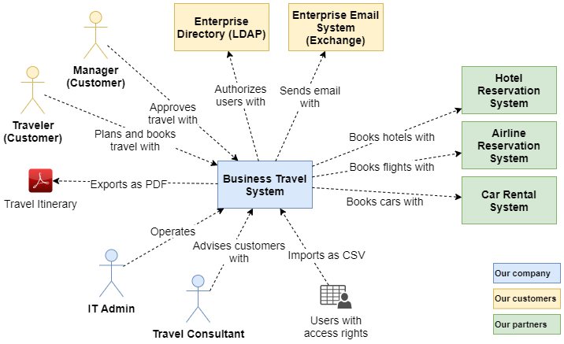
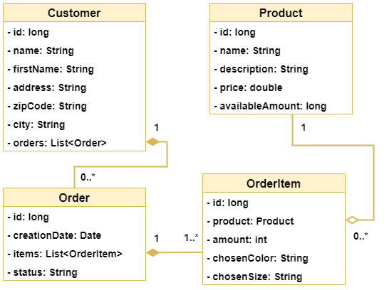
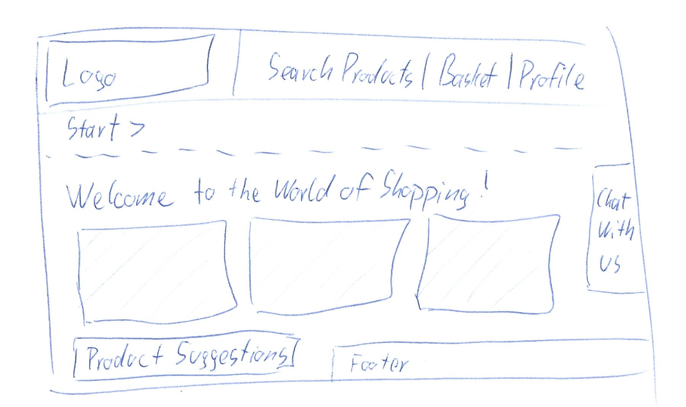
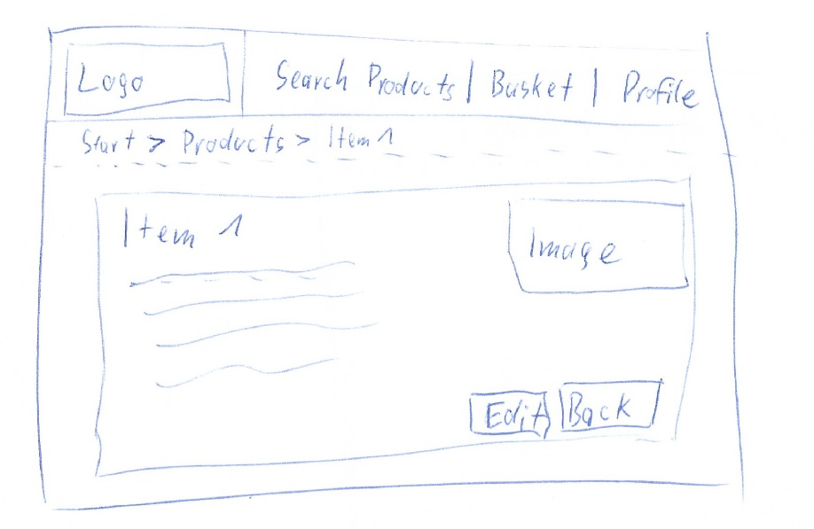

# Entwurf

> Dieser Entwurf legt die prinzipielle Lösungsarchitektur fest und enthält alles, was man benötigt, um einem Außenstehenden den prinzipiellen Aufbau der App erklären zu können.
> Der Fokus liegt auf einem groben Überblick und vereinzelten wichtigen Details (**keep it simple**).

**TODO:** Beschreibung des grundlegenden Aufbaus

**TODO:** Verweis auf Standards wie zum Beispiel verwendete Entwurfsmuster (optional)

## System Context Diagram

**TODO:** System Context Diagram der App erstellen und externe Entitäten kurz beschreiben (Rollen, externe Systeme, im- oder exportierte Daten)

## Domain Model

**TODO:** Domain Model der zentralen Entitäten und deren Beziehungen erstellen

## Beschreibung der Java-Packages der API

**TODO:** Auflistung der geplanten Java-Packages der API mit kurzer Beschreibung (nur Top-Level-Packages)

## Beschreibung der Frontend-Views

**TODO:** Auflistung der geplanten Frontend-Views mit kurzer Beschreibung

## GUI-Skizze: Home-View

**TODO:** Eigene möglichst handschriftliche GUI-Skizze erstellen und beschreiben

## GUI-Skizze: Ausgewählte wichtige Detail-View

**TODO:** Eigene möglichst handschriftliche GUI-Skizze erstellen und beschreiben